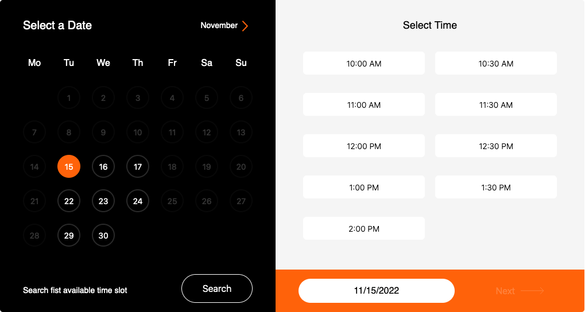

# Get started with the Booker25 JS SDK

This project uses the [Booker25 JS SDK](https://github.com/booker25/js-sdk) to implement an application that lets a user book an appointment with you via [Booker25](https://booker25.com).

## Demo

You can find a demo [here](https://booker25.github.io/js-sdk-example/).

## Environment variables

| Var                       | Description                                                                                                                              |
|---------------------------|------------------------------------------------------------------------------------------------------------------------------------------|
| REACT_APP_ENVIRONMENT     | The environment to use. Can be one of the following: DEVELOP, ACCEPTANCE, STAGING, PRODUCTION. Default: PRODUCTION                       |
| REACT_APP_API_KEY         | The api key of your Booker25 Landingpage environment. Can be configured via [https://welcome.booker25.com](https://welcome.booker25.com) |
| REACT_APP_B25_RESOURCES   | The resources you want to generate timeslots for. List of Salesforce ids seperated by a semicolon (;)                                    |
| REACT_APP_TIMESLOT_LENGTH | The length of the timeslots in minutes                                                                                                   |

## Available Scripts

In the project directory, you can run:

### `yarn start`

Runs the app in the development mode.\
Open [http://localhost:3000](http://localhost:3000) to view it in the browser.

The page will reload if you make edits.\
You will also see any lint errors in the console.

### `yarn build`

Builds the app for production to the `build` folder.\
It correctly bundles React in production mode and optimizes the build for the best performance.
